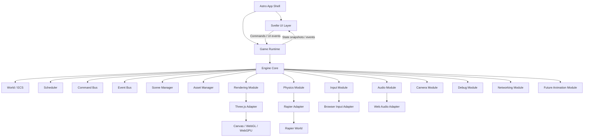
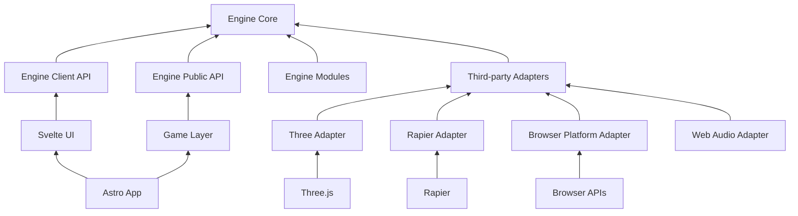
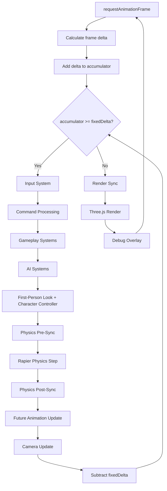
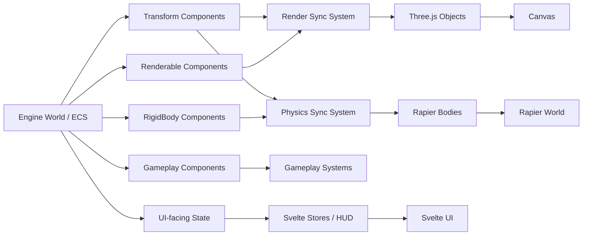
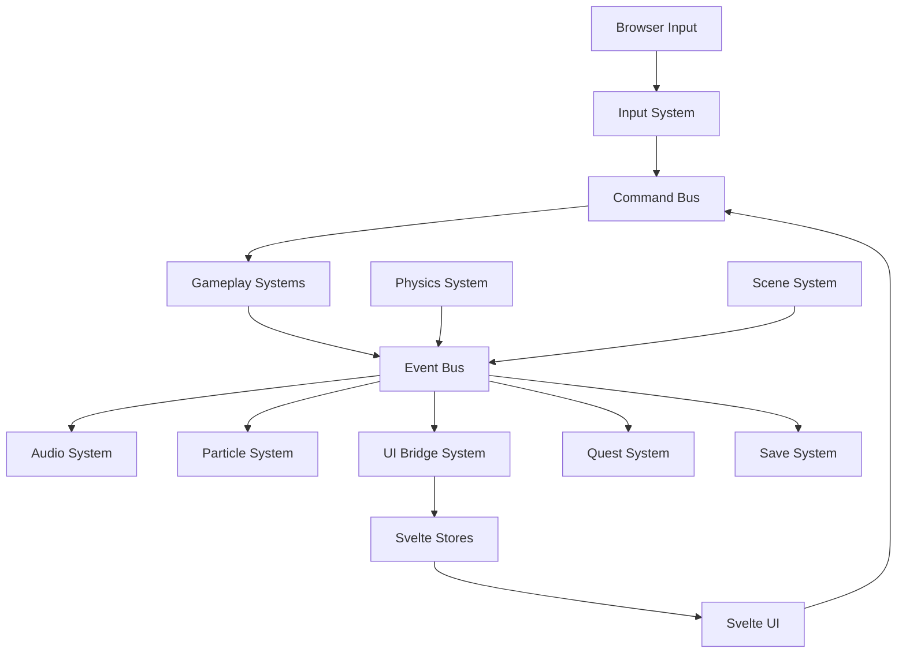
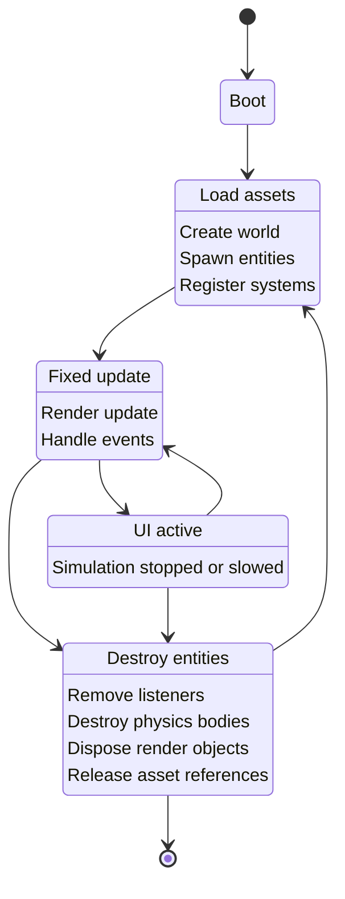
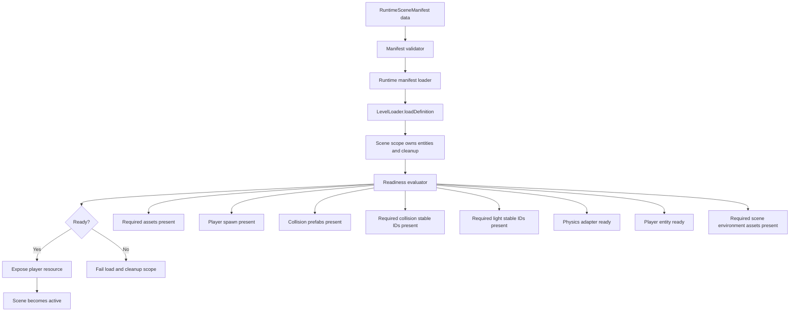
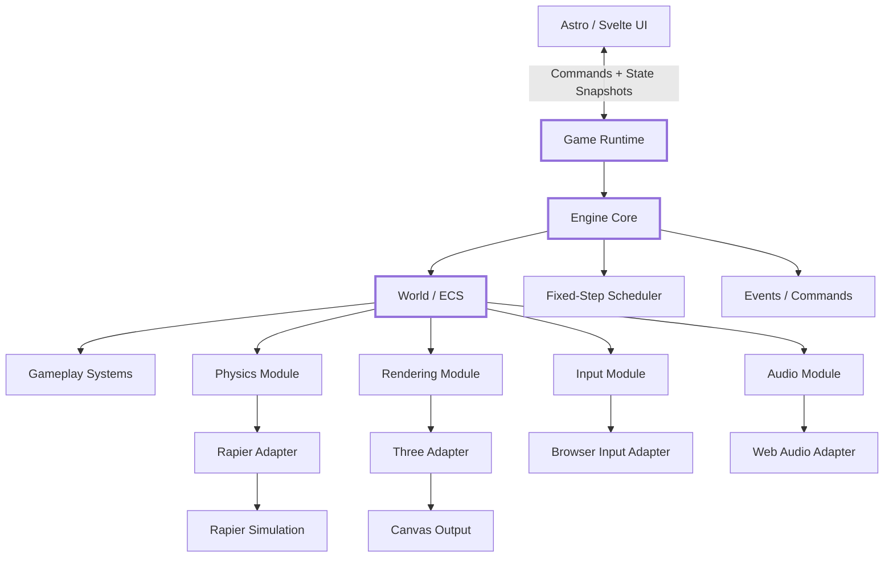

# Game Engine Architecture

This document defines the architectural rules and visual flow for a browser-based game engine using Astro, Svelte, Three.js, and Rapier. Threlte remains a possible future presentation/editor integration, but the current runtime does not keep a placeholder Threlte adapter.

The core principle:

> Astro owns pages. Svelte owns UI. The runtime owns the game loop. The engine core owns state. Systems transform state. Adapters talk to external libraries.

---

## 1. High-level Engine Architecture



The important idea here is that **Astro and Svelte sit outside the engine**. They launch it, observe it, and send commands to it, but they do not own runtime state.

---

## 2. Dependency Direction Diagram

This is one of the most important diagrams for preventing fragmentation.



Rule this diagram enforces:

```text
Dependencies point inward toward the engine core.
The core does not import Astro, Svelte, Three, Threlte, or Rapier.
```

If you ever see this:

```ts
// engine/core/World.ts
import * as THREE from 'three'
```

That is an architecture violation.

---

## 3. Runtime Update Loop

This shows how a AAA-style fixed simulation loop fits inside a browser render loop.



Target flow:

```text
Browser frame is variable.
Game simulation is fixed.
Rendering happens after simulation catches up.
```

Current first-person runtime slice:

```text
BrowserInputAdapter
  -> InputSnapshot
  -> held-look pointer gate + click candidates
  -> mobile touch controls through MobileInputControlsPort
	  -> PlayerInput component
	  -> MoveEntity / JumpEntity / InteractAtScreenPoint / InteractWithActiveTarget commands
	  -> ActiveInteractionTarget selected from proximity candidates
	  -> MovementIntent component
	  -> FirstPersonController yaw/pitch
	  -> CharacterMotor component
	  -> KinematicCharacterController system
	  -> CharacterController movement, sprint, gravity, jump state
	  -> Transform
	  -> CameraTarget
	  -> camera:activePose resource
	  -> ThreeRendererAdapter camera
	  -> ChargedAction component and semantic charge/release events
	  -> PlayerLightFeedback updates the player Light component while held
	  -> LightSyncSystem projects player-light changes through the renderer adapter
	  -> AudioManifestAndEvents charge-release SFX mapping
```

The default browser mouse path is hold-drag look. The browser input adapter owns
look activation and emits pointer delta only while held look is active. The
canvas may support pointer lock as a future explicit mode, but Svelte does not
own movement, camera state, or mouse-down state. Pointer delta enters through
the browser input adapter and is consumed by engine systems. When focus,
visibility, UI capture, or scene readiness disables gameplay input, the input
module clears stale keyboard, mouse, touch, gamepad, pointer delta, and click
state instead of replaying it after input is re-enabled.
Mobile controls are a UI input surface only; they call the engine-facing mobile
input port, and gameplay systems turn those actions into commands/events. They
do not own player transform, camera, charge, portal, or physics state.

The portal player light follows the same ownership rule. It is an authored
`Light` component on the stable `player` entity and is required through
`RuntimeSceneManifest.readiness.requiredLightStableIds`. Held charge updates
game-owned `PlayerLightFeedback` and engine `Light` component state; the
`LightSyncSystem` is the only path that projects those changes into the Three
adapter. UI, Svelte, and renderer objects do not own player-light brightness,
range, or release behavior.

The app layer creates browser, Three, Rapier, audio, and asset adapters, then
delegates gameplay system registration and scene loading to the game runtime
factory. The game runtime composes engine ports and game systems, but it does
not import browser APIs or third-party framework packages directly.

---

## 4. Engine Data Ownership

This diagram shows who owns what.



This diagram's rule:

```text
The entity/component world owns the truth.
Three, Rapier, and Svelte mirror parts of that truth.
```

For first-person play, the player remains an entity. The local view is a camera pose derived from `Transform + FirstPersonController + CameraTarget`; it is not owned by a Svelte component or by a Three camera object.

---

## 5. Event and Command Flow

This is useful for stopping systems from directly calling each other.



Good pattern:

```text
UI and input create commands.
Gameplay consumes commands.
Systems emit events.
Other systems react to events.
```

Bad pattern:

```text
PlayerController directly calls AudioSystem, UISystem, QuestSystem, SaveSystem, and ParticleSystem.
```

---

## 6. Scene Lifecycle

This diagram is useful for preventing cleanup bugs.



The key scene rule:

```text
Anything created during load must be destroyed during unload.
```

### Runtime Scene Catalog And Load Path

Playable scenes use explicit runtime scene manifests and a central checked-in
scene catalog during `Loading`. This keeps scene composition data-driven,
supports a declared default scene, and prevents gameplay from starting because
an entity happened to mount.



Current rule:

```text
Game scenes load through RuntimeSceneManifest-owned assets and prefabs,
LevelLoader, and readiness evaluation before player-controlled gameplay is
exposed.
Runtime scene transitions resolve target scenes by manifest ID from the game
runtime catalog, not by level-specific branches in the app shell or engine core.
Render profiles also declare the scene environment. Required environment
assets are manifest-owned, preloaded with the selected scene, included in
readiness when required, and projected by the renderer adapter only after the
scene preload succeeds.
The current default runtime scenes use `cubemap-skybox`. The scene environment
contract also accepts equirectangular texture skies, muted video skies,
procedural atmosphere, bounded dynamic capture, and authored reflection probes
for future scenes. Completed sky/environment packets live in
`docs/Done/SCENE_ENVIRONMENT_FEATURE_PLAN.md` and
`docs/Done/SKYBOX_CUBEMAP_SYSTEM_REVIEW.md`; future skybox and scene-environment
packets are tracked in `docs/SKYBOX_FUTURE_FEATURES_IMPLEMENTATION_PLAN.md`.
Readiness also checks exact required collision stable IDs and exact required
light stable IDs, so authored scene-critical collision and lighting cannot be
accidentally skipped by spawning only a matching prefab family.
```

Forbidden shortcuts:

```text
Do not load playable scenes from loose component lists.
Do not repair missing authored data at runtime.
Do not expose player resources until the manifest readiness gate passes.
Do not register playable scene assets or prefabs from prototype defaults when
the selected runtime manifest declares its own content.
Do not preload hidden boot asset groups outside the selected manifest's level
preload contract.
Do not pre-register assets from the full runtime scene catalog as a substitute
for selected-manifest asset ownership.
Do not let a renderer, UI component, or runtime fallback choose a skybox that is
not declared by the selected runtime scene manifest.
```

Current migrated content slice:

```text
portal_arena_runtime
  -> default navigation room
  -> eight authored portal slots on a large generated GLB moor field
  -> one real GLB portal gate asset referenced through mesh_portal_gate
  -> one real GLB field asset referenced through mesh_portal_field
  -> explicit large flat collision proxy owned by portal_arena_floor
  -> required player-carried point light with held-charge feedback
  -> one real portal-deck scene music asset referenced through audio_ambient_portal_deck
  -> portal activation SFX referenced through audio_portal_activate
  -> player charge-release SFX referenced through audio_player_charge_release
  -> Portal components contribute proximity candidates for active target selection
  -> active portals currently target prototype_arena_runtime and miranda_deck_runtime

miranda_deck_runtime
  -> old Miranda spawn as authored player transform
  -> miranda_floor_main static render/physics prefab
  -> miranda_floor_upper static render/physics prefab
  -> miranda cockpit glow panels as static render/physics prefabs
  -> miranda crew bunks and locker bank as static render/physics prefabs
  -> miranda Captain's Office desk, chair, and safe as static render/physics prefabs
  -> miranda Engine Room core and columns as static render/physics prefabs
  -> miranda Medbay pods, Mess Hall blockers, Chapel altar, Brig blockers,
     Cargo Hold stacks, and Archive server banks as static render/physics prefabs
  -> Miranda primitive material assets preserve authored base color, emissive,
     metalness, roughness, and Medbay opacity parameters through manifest data
  -> Miranda scene music referenced through audio_ambient_wicked_shadows_whisper
  -> player charge-release SFX referenced through audio_player_charge_release
  -> nine Miranda StoryNote markers with trigger colliders, authored note data,
     nearest-target HUD prompts, and gameplay-owned reader open/close state
  -> three authored Miranda point lights as Transform + Light entities
  -> readiness requires player, material/audio/environment assets, collision
     prefabs, exact collision stable IDs, and exact authored light stable IDs

observatory_runtime
  -> target-engine recreation from old Observatory source art and scene
     evidence only
  -> implemented foundation packet in docs/OBSERVATORY_PLAYABLE_FOUNDATION_PLAN.md
  -> source GLB visual owned as mesh_observatory_environment
  -> explicit flat observatory:walkable-proxy collision; no render mesh
     collision inference
  -> static observatory:water visual through WaterSurfaceContract with no
     collider
  -> cubemap_observatory_sky through the selected render profile
  -> required player-carried Transform + Light entity
  -> three required authored firefly Transform + Renderable + Light entities
  -> portal transition from portal_arena_runtime by runtime manifest ID
  -> readiness requires player, exact collision stable IDs, exact light stable
     IDs, required assets, and physics/player readiness
  -> no old runtime JSON, terrain chunk runtime, generated collision binary,
     Svelte/Threlte light owner, hidden renderer default, or point-light
     budget/controller path
```

Full Miranda is not treated as ready until the terrain collision manifest gap
from the old runtime contract is solved in the new architecture.

The app layer may select a checked-in runtime manifest and pass it into the
client mount. If it does not, the game layer's `defaultRuntimeSceneManifest`
selects `portal_arena_runtime`. Selection and runtime scene transition rules
must stay outside generic engine code; the engine still consumes only validated
`RuntimeSceneManifest` data.

---

## 7. Suggested Project Map

```mermaid
flowchart TD
    Root[src/] --> App[app/]
    Root --> UI[ui/]
    Root --> Game[game/]
    Root --> Engine[engine/]

    App --> AstroPages[Astro pages]
    App --> AppShell[App shell]
    App --> GameMount[Game mount]

    UI --> HUD[HUD]
    UI --> Menus[Menus]
    UI --> EditorPanels[Editor panels]
    UI --> DebugUI[Debug UI]

    Game --> Levels[levels/]
    Game --> GameplaySystems[gameplay systems/]
    Game --> Prefabs[prefabs/]
    Game --> GameData[game data/]

    Engine --> Core[core/]
    Engine --> Modules[modules/]
    Engine --> Adapters[adapters/]
    Engine --> Data[data/]

    Core --> World[World]
    Core --> ECS[ECS]
    Core --> Scheduler[Scheduler]
    Core --> Events[Events]
    Core --> Commands[Commands]
    Core --> Time[Time]

    Modules --> Rendering[rendering/]
    Modules --> Physics[physics/]
    Modules --> Input[input/]
    Modules --> Assets[assets/]
    Modules --> Audio[audio/]
    Modules --> Camera[camera/]
    Modules --> Debug[debug/]
    Modules --> Networking[networking/]
    Modules --> Scene[scene/]

    Adapters --> Three[three/]
    Adapters --> Rapier[rapier/]
    Adapters --> Browser[browser/]
```



---

## 8. Primary Repo Diagram

This is the diagram to keep near the top of the repo.



---

## 9. Core Architecture Rules

### Ownership Rules

```text
1. The engine world is the source of truth.
2. Svelte stores may mirror engine state but may not own runtime game state.
3. Three.js objects are render representations only.
4. Rapier objects are physics representations only.
5. Gameplay code must not directly mutate Three or Rapier objects.
6. All third-party libraries must be accessed through adapters.
7. Engine core must remain plain TypeScript.
```

### Dependency Rules

```text
1. engine/core imports nothing from app, ui, game, three, threlte, or rapier.
2. engine/modules may import engine/core.
3. engine/adapters may import third-party libraries.
4. game may import engine APIs, but engine may not import game code.
5. ui may observe engine state and dispatch commands.
6. app initializes the runtime but does not contain gameplay logic.
```

### Update Rules

```text
1. Simulation uses a fixed timestep.
2. Render loop uses requestAnimationFrame.
3. System order is explicit.
4. No system should rely on accidental execution order.
5. Cross-system communication uses commands/events, not direct calls.
```

### Data Rules

```text
1. Entities are composed from components.
2. Prefabs define reusable entities.
3. Levels define scene composition.
4. Assets are referenced by stable IDs.
5. Level instances must declare authored stable IDs.
6. Runtime scene manifests define the playable scene load contract and own the asset/prefab data registered for that scene.
7. Runtime scene readiness declares required assets, player spawn, collision prefabs, exact collision stable IDs, and exact light stable IDs.
8. The game runtime catalog declares available runtime scenes and the default runtime scene.
9. Runtime state must be serializable where practical.
```

### Cleanup Rules

```text
1. Every object created by a scene must be owned by that scene or an engine subsystem.
2. Every event listener must be removable.
3. Every physics body must be destroyed when its entity is destroyed.
4. Every Three object must be disposed or pooled.
5. Scene unload must leave no runtime objects behind.
6. Renderer-owned scene environment, reflection probe, and light projection state must be cleared or restored on scene unload.
```

---

## 10. Practical Architecture Summary

```text
Astro owns pages.
Svelte owns UI.
Three owns current runtime presentation.
Threlte is deferred until a real consumer exists.
Rapier owns simulation internals.
The engine owns game state.
The game layer owns meaning.
```

Current website cutover rule:

```text
Normal root game scripts target @merkin/game-megameal.
The old @merkin/game app is reference-only and can run only through explicit
:legacy root aliases.
```

The normal game website must mount `apps/game.megameal/src/app/GameClient.svelte`
through the Astro app shell. It must not mount the old `apps/game`
`ThreltGame` runtime, import old runtime code, or bridge old Svelte/Threlte
state into the new engine.

Short version:

```text
Frameworks display the game.
The engine runs the game.
```
