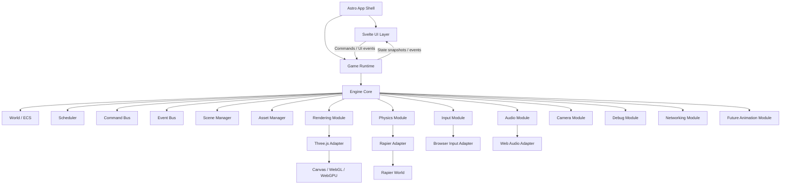
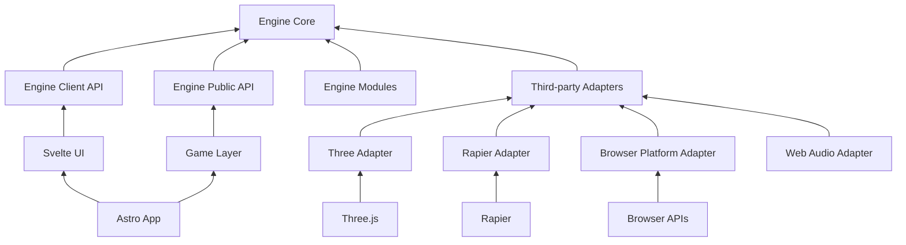
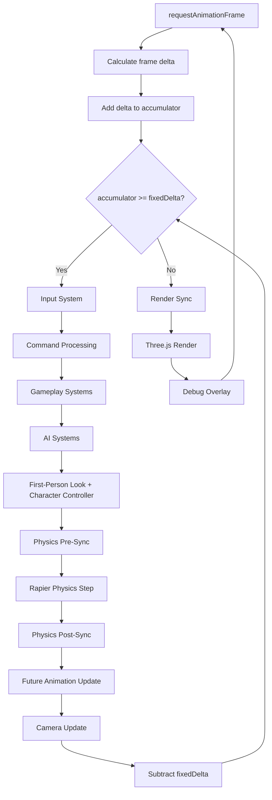
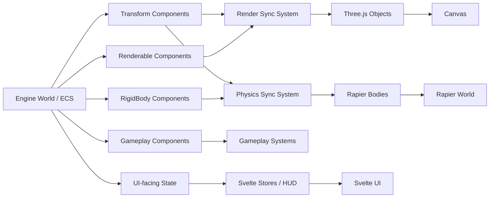
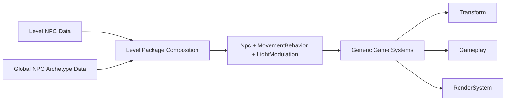
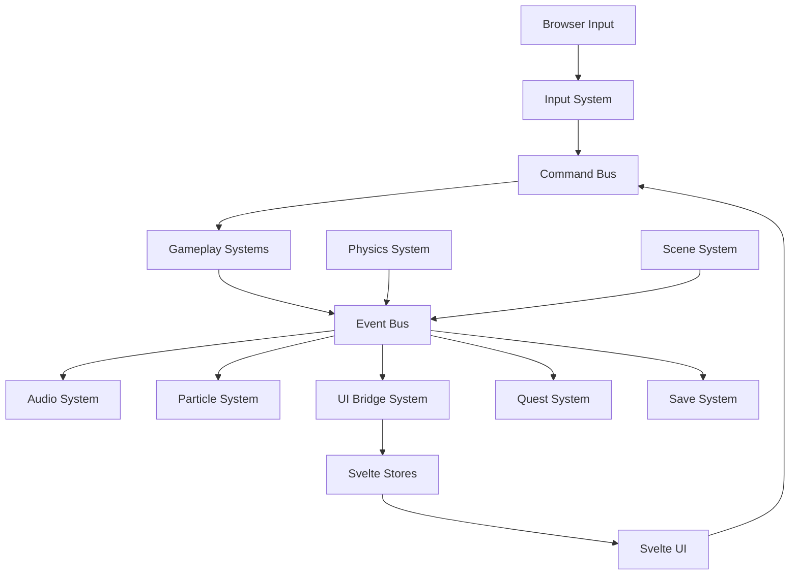
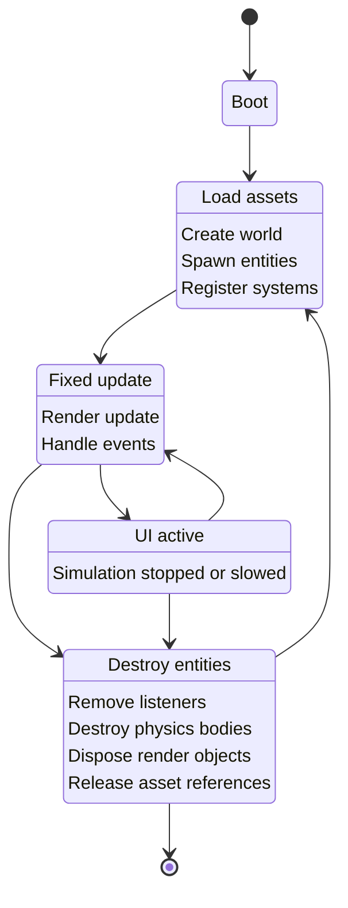
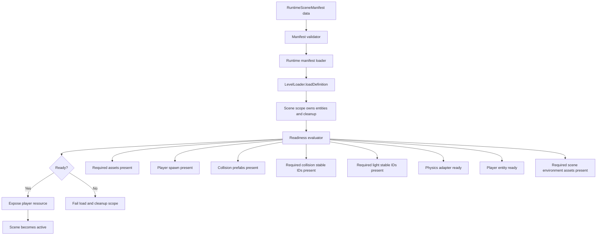

# Game Engine Architecture

This document defines the architectural rules and visual flow for a browser-based game engine using Astro, Svelte, Three.js, and Rapier. Threlte remains a possible future presentation/editor integration, but it should not become runtime ownership until a real consumer exists.

The core principle:

> Astro owns pages. Svelte owns UI. The runtime owns the game loop. The engine core owns state. Systems transform state. Adapters talk to external libraries.

---

## 1. High-level Engine Architecture



The important idea here is that **Astro and Svelte sit outside the engine**. They launch it, observe it, and send commands to it, but they do not own runtime state.

---

## 2. Dependency Direction Diagram

This is one of the most important diagrams for preventing fragmentation.



Rule this diagram enforces:

```text
Dependencies point inward toward the engine core.
The core does not import Astro, Svelte, Three, Threlte, or Rapier.
```

If you ever see this:

```ts
// engine/core/World.ts
import * as THREE from 'three'
```

That is an architecture violation.

---

## 3. Runtime Update Loop

This shows how a AAA-style fixed simulation loop fits inside a browser render loop.



Target flow:

```text
Browser frame is variable.
Game simulation is fixed.
Rendering happens after simulation catches up.
```

Target first-person runtime slice:

```text
BrowserInputAdapter
  -> InputSnapshot
  -> held-look pointer gate + click candidates
  -> mobile touch controls through MobileInputControlsPort
	  -> PlayerInput component
	  -> MoveEntity / JumpEntity / InteractAtScreenPoint / InteractWithActiveTarget commands
	  -> ActiveInteractionTarget selected from proximity candidates
	  -> HUD projects only the selected ActiveInteractionTarget
	  -> MovementIntent component
	  -> FirstPersonController yaw/pitch
	  -> CharacterMotor component
	  -> KinematicCharacterController system
	  -> CharacterController movement, sprint, gravity, jump state
	  -> Transform
	  -> CameraTarget
	  -> camera:activePose resource
	  -> ThreeRendererAdapter camera
	  -> ChargedAction component and semantic charge/release events
	  -> PlayerLightFeedback updates the player Light component while held
	  -> LightSyncSystem projects player-light changes through the renderer adapter
	  -> AudioManifestAndEvents charge-release SFX mapping
```

The default browser mouse path is hold-drag look. The browser input adapter owns
look activation and emits pointer delta only while held look is active. The
canvas may support pointer lock as a future explicit mode, but Svelte does not
own movement, camera state, or mouse-down state. Pointer delta enters through
the browser input adapter and is consumed by engine systems. When focus,
visibility, UI capture, or scene readiness disables gameplay input, the input
module clears stale keyboard, mouse, touch, gamepad, pointer delta, and click
state instead of replaying it after input is re-enabled.
Mobile controls are a UI input surface only; they call the engine-facing mobile
input port with semantic action IDs, and gameplay systems turn those actions
into commands/events. Raw browser touch identifiers are not a parallel gameplay
input surface. Mobile controls do not own player transform, camera, charge,
portal, or physics state.
Scene unload cleanup removes player, portal, story-note, open reader, and
selected `ActiveInteractionTarget` resources so HUD and activation state cannot
point at unloaded entities.

The portal player light follows the same ownership rule. It is an authored
`Light` component on the stable `player` entity, sourced from configurable
player package data under `src/levels/player`, and required through
`RuntimeSceneManifest.readiness.requiredLightStableIds` when a level enables the
player light. Held charge updates game-owned `PlayerLightFeedback` and engine
`Light` component state; the `LightSyncSystem` is the only path that projects
those changes into the Three adapter. UI, Svelte, and renderer objects do not
own player-light brightness, range, or release behavior.

The app layer creates browser, Three, Rapier, audio, and asset adapters, then
delegates gameplay system registration and scene loading to the game runtime
factory. The game runtime composes engine ports and game systems, but it does
not import browser APIs or third-party framework packages directly.

---

## 4. Engine Data Ownership

This diagram shows who owns what.



This diagram's rule:

```text
The entity/component world owns the truth.
Three, Rapier, and Svelte mirror parts of that truth.
```

For first-person play, the player remains an entity. The local view is a camera pose derived from `Transform + FirstPersonController + CameraTarget`; it is not owned by a Svelte component or by a Three camera object.

Authored non-player world objects that move are modeled as NPC moving actors.
The level package owns their archetype and instance data, while generic game
systems own movement, significance, light modulation, interaction, and dialog.
Species-specific names such as firefly are content data only; runtime systems
query `Npc`, `MovementBehavior`, `LightModulation`, `InteractionTarget`, and
`Conversation` components without branching on the species.



---

## 5. Event and Command Flow

This is useful for stopping systems from directly calling each other.



Good pattern:

```text
UI and input create commands.
Gameplay consumes commands.
Systems emit events.
Other systems react to events.
```

Bad pattern:

```text
PlayerController directly calls AudioSystem, UISystem, QuestSystem, SaveSystem, and ParticleSystem.
```

---

## 6. Scene Lifecycle

This diagram is useful for preventing cleanup bugs.



The key scene rule:

```text
Anything created during load must be destroyed during unload.
```

### Runtime Scene Catalog And Load Path

Playable scenes use explicit runtime scene manifests and a central checked-in
scene catalog during `Loading`. This keeps scene composition data-driven,
supports a declared default scene, and prevents gameplay from starting because
an entity happened to mount.



Target rule:

```text
Game scenes load through `RuntimeSceneManifest`-owned assets and prefabs, level
loading, and readiness evaluation before player-controlled gameplay is exposed.
Runtime scene transitions resolve target scenes by manifest ID from the runtime
scene catalog supplied by product configuration, not by level-specific branches
in the app shell, game engine, or engine core.
Render profiles expose the scene environment consumed by the renderer, but
level packages may compose that environment from a dedicated level-owned
skybox/environment file. Required environment assets remain manifest-owned,
preloaded with the selected scene, included in readiness when required, and
projected by the renderer adapter only after the scene preload succeeds.
Scene environments should support cubemap skies, equirectangular texture skies,
muted video skies, procedural atmosphere, bounded dynamic capture, and authored
reflection probes through the same manifest-owned contract.
Readiness also checks exact required collision stable IDs and exact required
light stable IDs, so authored scene-critical collision and lighting cannot be
accidentally skipped by spawning only a matching prefab family.
```

Forbidden shortcuts:

```text
Do not load playable scenes from loose component lists.
Do not repair missing authored data at runtime.
Do not expose player resources until the manifest readiness gate passes.
Do not register playable scene assets or prefabs from prototype defaults when
the selected runtime manifest declares its own content.
Do not preload hidden boot asset groups outside the selected manifest's level
preload contract.
Do not pre-register assets from the full runtime scene catalog as a substitute
for selected-manifest asset ownership.
Do not let a renderer, UI component, or runtime fallback choose a skybox that is
not declared by the selected level package and composed into the selected
runtime scene manifest.
```

Product content package rules:

```text
runtime scene manifest
  -> level data
  -> asset manifest
  -> prefab catalog
  -> render profile
  -> readiness contract
  -> transition targets by manifest ID
```

Product levels may include navigation rooms, portals, authored collision,
authored lighting, story content, scene music, water surfaces, and migrated
content from reference projects. Those details remain product data. They do not
become engine defaults, app-shell branches, renderer fallbacks, or hidden
runtime repair paths.

Full-level readiness is a data contract, not a claim in this architecture
document. The contract register tracks which product packets are currently
implemented, partial, or future.

The app layer may select a checked-in runtime manifest and pass it into the
client mount. If it does not, `src/levels/global/settings.ts` owns the product
default scene ID and `src/levels/global/router.ts` resolves the selected level
bundle. Selection and runtime scene transition rules must stay outside generic
engine code; the engine still consumes only validated `RuntimeSceneManifest`
data.

Levels and editor tooling are intentionally separate product packages:

```text
src/levels
  -> product level package

src/levels/global
  -> package settings, shared package assets/prefabs, global performance config,
     and the runtime-scene router

src/levels/player
  -> user-configurable player prefab, assets, audio defaults, readiness constants,
     and spawn helper data imported by level packages

src/levels/<level>
  -> one level folder containing that level's level data, local asset manifest,
     local prefab definitions, audio content mapping, base render profile,
     skybox/environment data, runtime manifest, player spawn/override config,
     and per-level performance config

src/editor
  -> optional external tooling windows, including the master-control architecture
     map and DEV-only data authoring panels

src/game
  -> gameplay meaning, systems, generic prefab registry/spawn mechanics,
     runtime composition, game rules, and generic performance systems
```

`src/game` must not be the owner of shipped level packs, product asset catalogs,
product prefab definitions, runtime scene catalogs, or editor tools. The normal
runtime may consume a selected level package through the level package router,
but level data should be replaceable as a product input. If `src/levels` is
absent, app startup should fail with an explicit missing-level-package error
rather than leaving hardcoded Megameal level IDs or orphan product data
elsewhere. Editor tools must remain
optional and removable: deleting the editor surface must not break the normal
game route, engine runtime, runtime scene loading, adapters, or game validation.
During local development, editor data panels may save approved checked-in level
package files through a DEV-only app-layer API. Those saves are source edits,
not runtime ownership, and the normal game still consumes rebuilt or reloaded
level package data through the router and manifest contracts.

### Performance System Ownership

Core performance systems belong in `src/game/performance`. This folder owns the
generic runtime-facing domains for LOD, culling, streaming, collision
performance, and diagnostics. It must not contain product-specific level data or
editor UI.

Performance configuration belongs to the level package. Global defaults live in
`src/levels/global/performance.json`, while each level may override those values
through `src/levels/<level>/performance.json`. `defineLevelPackage()` composes
the global and level config into the runtime scene level resources under
`game:performanceConfig`; runtime systems read that resource and never hardcode
level IDs.

The editor may expose performance controls and diagnostics through DEV-only
APIs, but editor code is not part of normal gameplay flow. Saving a performance
setting edits the owning file under `src/levels`; live diagnostics come from the
running game through the development bridge. Stage-one support is configuration
and measurement only: LOD, culling, and streaming runtime behavior remain future
packets until their systems, data contracts, and focused validation exist.

### Live Development Editor Bridge

The local development editor may observe and command the running game through a
DEV-only app-layer bridge. This bridge is not a product runtime dependency and
does not make the editor the owner of runtime state. The running game publishes
serializable snapshots, including the active runtime scene ID and runtime-owned
diagnostics, and accepts explicit editor commands that are validated by existing
game/runtime contracts.

```mermaid
flowchart TD
    Router[src/levels/global/router.ts] --> Discovery[src/app/levelPackageDiscovery.ts]
    Discovery --> EditorLevels[/editor level tree]
    Discovery --> GameStartup[game startup catalog]

    GameRuntime[Game Runtime] --> Snapshot[DEV runtime snapshot]
    Snapshot --> Bridge[src/app/gameDevBridge.ts]
    Bridge --> EditorLive[/editor live panel]
    EditorLive -->|loadRuntimeScene| Bridge
    Bridge --> RuntimeSceneTransition[RuntimeSceneTransitionPort]
    RuntimeSceneTransition --> GameRuntime
```

The level router remains the source of available runtime scenes. The live bridge
is the source of current running-game state. If no game tab is publishing a
snapshot, the editor may still show router-owned available levels, but it must
not invent an active runtime scene.

---

## 7. Suggested Project Map

```mermaid
flowchart TD
    Root[src/] --> App[app/]
    Root --> UI[ui/]
    Root --> Game[game/]
    Root --> Multiplayer[multiplayer/]
    Root --> Global[global/]
    Root --> Levels[levels/]
    Root --> Editor[editor/]
    Root --> Engine[engine/]

    App --> AstroPages[Astro pages]
    App --> AppShell[App shell]
    App --> GameMount[Game mount]

    UI --> HUD[HUD]
    UI --> Menus[Menus]
    UI --> EditorPanels[Editor panels]
    UI --> DebugUI[Debug UI]

    Game --> GameplaySystems[gameplay systems/]
    Game --> PrefabRegistry[prefab registry]
    Game --> GameData[game data/]
    Game --> Performance[performance/]

    Multiplayer --> MultiplayerContracts[session contracts]
    Multiplayer --> MultiplayerSystems[replicated-player systems]
    Multiplayer --> MultiplayerMessages[wire messages]

    Global --> RuntimeSettings[runtime settings]
    Global --> GlobalPerformance[global performance config]
    Levels --> LevelData[level data]
    Levels --> LevelAssets[product asset manifests]
    Levels --> LevelPrefabs[product prefab definitions]
    Levels --> PlayerPackage[player package]
    Levels --> RuntimeManifests[runtime scene manifests]
    Levels --> AudioMappings[audio mappings]
    Levels --> RenderProfiles[render profiles]
    Levels --> SkyboxData[skybox/environment data]
    Levels --> LevelPerformance[per-level performance config]
    Editor --> MasterControl[master-control map]

    Engine --> Core[core/]
    Engine --> Modules[modules/]
    Engine --> Adapters[adapters/]
    Engine --> Data[data/]

    Core --> World[World]
    Core --> ECS[ECS]
    Core --> Scheduler[Scheduler]
    Core --> Events[Events]
    Core --> Commands[Commands]
    Core --> Time[Time]

    Modules --> Rendering[rendering/]
    Modules --> Physics[physics/]
    Modules --> Input[input/]
    Modules --> Assets[assets/]
    Modules --> Audio[audio/]
    Modules --> Camera[camera/]
    Modules --> Debug[debug/]
    Modules --> Networking[networking/]
    Modules --> Scene[scene/]

    Adapters --> Three[three/]
    Adapters --> Rapier[rapier/]
    Adapters --> Browser[browser/]
```



---

## 8. Primary Repo Diagram

This is the diagram to keep near the top of the repo.

```mermaid
flowchart TD
    UI[Astro / Svelte UI] <-->|Commands + State Snapshots| Runtime[Game Runtime]
    Editor[/editor] <-->|DEV snapshots + commands| DevBridge[App Dev Bridge]
    DevBridge --> Runtime

    Runtime --> Core[Engine Core]
    Core --> World[World / ECS]
    Core --> Scheduler[Fixed-Step Scheduler]
    Core --> Events[Events / Commands]

    World --> Gameplay[Gameplay Systems]
    World --> Performance[Performance Systems]
    World --> Physics[Physics Module]
    World --> Rendering[Rendering Module]
    World --> Audio[Audio Module]
    World --> Input[Input Module]

    Levels[Level Package Performance Config] --> Runtime

    Physics --> Rapier[Rapier Adapter]
    Rendering --> Three[Three Adapter]
    Input --> Browser[Browser Input Adapter]
    Audio --> WebAudio[Web Audio Adapter]

    Rapier --> PhysicsSim[Rapier Simulation]
    Three --> Canvas[Canvas Output]

    style Core stroke-width:3px
    style World stroke-width:3px
    style Runtime stroke-width:3px
```

---

## 9. Core Architecture Rules

### Ownership Rules

```text
1. The engine world is the source of truth.
2. Svelte stores may mirror engine state but may not own runtime game state.
3. Three.js objects are render representations only.
4. Rapier objects are physics representations only.
5. Gameplay code must not directly mutate Three or Rapier objects.
6. All third-party libraries must be accessed through adapters.
7. Engine core must remain plain TypeScript.
```

### Dependency Rules

```text
1. engine/core imports nothing from app, ui, game, three, threlte, or rapier.
2. engine/modules may import engine/core.
3. engine/adapters may import third-party libraries.
4. game may import engine APIs, but engine may not import game code.
5. multiplayer may import engine APIs and narrow game-owned runtime constants,
   but browser transports stay in adapters and presentation stays in ui/app.
6. ui may observe engine state and dispatch commands.
7. app initializes the runtime but does not contain gameplay logic.
```

### Update Rules

```text
1. Simulation uses a fixed timestep.
2. Render loop uses requestAnimationFrame.
3. System order is explicit.
4. No system should rely on accidental execution order.
5. Cross-system communication uses commands/events, not direct calls.
```

### Data Rules

```text
1. Entities are composed from components.
2. Prefabs define reusable entities.
3. Levels define scene composition.
4. Assets are referenced by stable IDs.
5. Level instances must declare authored stable IDs.
6. Runtime scene manifests define the playable scene load contract and own the product asset/prefab data registered for that scene.
7. Runtime scene readiness declares required assets, player spawn, collision prefabs, exact collision stable IDs, and exact light stable IDs.
8. Configurable player data belongs in `src/levels/player`; per-level files own only player spawn/override config.
9. Per-level skybox/environment files own sky media selection, background blur, background intensity, environment lighting intensity, and environment readiness/preload policy before those values are composed into `RenderProfileData.environment`.
10. The level package declares available runtime scenes; global settings declare default runtime selection.
11. Runtime scene IDs and shipped level-package lists belong under `src/levels`.
12. Runtime state must be serializable where practical.
```

### Cleanup Rules

```text
1. Every object created by a scene must be owned by that scene or an engine subsystem.
2. Every event listener must be removable.
3. Every physics body must be destroyed when its entity is destroyed.
4. Every Three object must be disposed or pooled.
5. Scene unload must leave no runtime objects behind.
6. Renderer-owned scene environment, reflection probe, and light projection state must be cleared or restored on scene unload.
```

---

## 10. Practical Architecture Summary

```text
Astro owns pages.
Svelte owns UI.
Three owns runtime presentation until another renderer adapter is explicitly selected.
Threlte is deferred until a real consumer exists.
Rapier owns simulation internals.
The engine owns game state.
The game layer owns meaning.
Global settings own startup policy.
Level packages own shipped scene data.
Optional tooling owns diagnostics and visualization surfaces.
```

Website ownership rule:

```text
Normal root game scripts target @merkin/game-megameal.
The old @merkin/game app is reference-only and can run only through explicit
:legacy root aliases.
```

The normal game website must mount `apps/game.megameal/src/app/GameClient.svelte`
through the Astro app shell. It must not mount the old `apps/game`
`ThreltGame` runtime, import old runtime code, or bridge old Svelte/Threlte
state into the new engine.

Short version:

```text
Frameworks display the game.
The engine runs the game.
```
