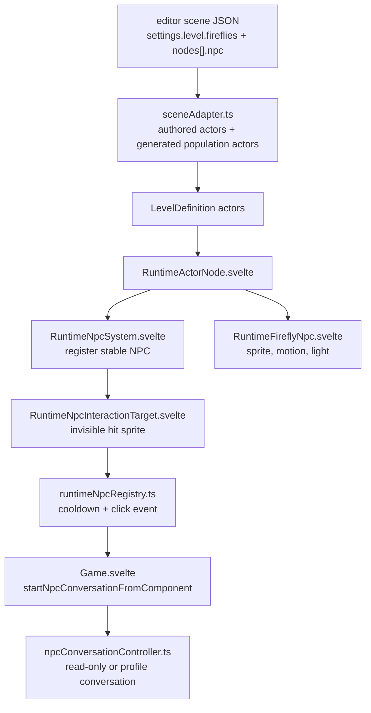

# Observatory Legacy Firefly NPC Behavior Inventory

Status: reference inventory only
Source application: `apps/game`
Target application: `apps/game.megameal`

This document records the behavior surface of the legacy firefly NPC system so
the rebooted engine can plan a clean implementation. It does not claim the
current `apps/game.megameal` runtime implements these behaviors.

## Source Evidence

- Legacy NPC packet docs: `apps/game/docs/npc-firefly-system/`
- NPC data contract: `apps/game/src/threlte/engine/npcTypes.ts`
- Runtime NPC registry: `apps/game/src/threlte/features/npc/runtimeNpcRegistry.ts`
- Runtime actor mounting path: `apps/game/src/threlte/levels/RuntimeActorNode.svelte`
- Firefly presentation: `apps/game/src/threlte/features/npc/presentation/RuntimeFireflyNpc.svelte`
- Firefly presentation resolver: `apps/game/src/threlte/features/npc/presentation/fireflyNpcPresentation.ts`
- Scene firefly field generation: `apps/game/src/threlte/engine/sceneFireflyFieldCore.mjs`
- Scene-to-level adapter: `apps/game/src/threlte/engine/sceneAdapter.ts`
- Runtime manifest firefly population summary: `apps/game/src/threlte/engine/runtimeSceneManifest.ts`
- NPC conversation controller: `apps/game/src/threlte/features/npc/npcConversationController.ts`
- Observatory source scene: `apps/game/src/threlte/editor/scenes/observatory.scene.json`

## High-Level Shape

The legacy system had two related firefly concepts:

1. Authored firefly NPCs: hand-placed actors with stable IDs, click
   interaction, per-NPC conversation data, hover-wander behavior, sprite
   presentation, and point-light presentation.
2. Generated ambient firefly field: a scene-level population generated from
   `settings.level.fireflies`, with many firefly actors distributed across a
   radius. These could be non-interactive atmosphere, or a configured subset
   could become interactive lost-soul/profile fireflies.

The old implementation was Svelte/Threlte-heavy. The feature set is useful
reference material, but the ownership pattern should not be copied directly
into the rebooted engine.

## Data Flow

## Authored Observatory Fireflies

The old Observatory scene had three hand-authored firefly NPCs:

- `observatory-archive-firefly`
- `observatory-lantern-firefly`
- `observatory-tide-firefly`

Each was an actor node with:

- `npc.id`
- `npc.archetype: "firefly"`
- `displayName`
- click `interaction` with prompt/event key/cooldown when needed
- `conversation` config
- `behavior` config
- `presentation` config

The Archive and Tide fireflies used read-only authored text. The Lantern
firefly used a profile conversation with `personalityId: "elara-voss"` and a
read-only fallback body.

## NPC Contract Features

The legacy NPC component supported:

- archetype: currently `firefly`
- interaction mode: `click` or `disabled`
- interaction prompt
- interaction event key
- interaction cooldown
- conversation modes:
  - `none`
  - `read-only`
  - `profile` with `personalityId` and optional fallback text
- behavior modes:
  - `static`
  - `hover-wander`
- presentation data for fireflies:
  - color and secondary color
  - sprite size
  - twinkle speed
  - light enabled flag
  - per-firefly lighting overrides
  - population ID/index/count
  - light phase
  - terrain-follow options
  - light-burst and selection boosts
  - optional shockwave response
- state/save keys for generated population actors

## Runtime Registration And Interaction

`RuntimeNpcSystem.svelte` registered any actor with an `npc` component.
`runtimeNpcRegistry.ts` owned the stable runtime registry.

Registry behavior included:

- registration by `(levelId, actorId)` and stable `npc.id`
- duplicate NPC ID diagnostics
- missing NPC ID diagnostics
- unsupported interaction mode diagnostics
- disabled NPC tracking
- click interaction filtering
- per-NPC cooldown tracking
- publishing a normalized `npc.interaction` event
- unregistering on actor unmount/reset

The interaction hit target was a transparent `THREE.Sprite` registered with the
existing interaction system. The hit sprite dispatched:

- click interaction
- hover state
- player light-burst response

## Firefly Motion And Visual Behavior

The old firefly presentation was not a static mesh. It rendered a `StarSprite`
and updated it every frame.

Motion behavior:

- stable animation phase derived from NPC ID
- circular hover-wander using sine/cosine offsets
- configurable wander radius and speed
- hover height offset
- bob amplitude and bob speed
- optional terrain-follow sampling every 0.3 seconds
- generated population drift using scene `sway` and `driftSpeed`

Visual behavior:

- sprite color from presentation data
- optional secondary color
- size scaling
- twinkle pulse
- selection overlay sprite
- hover brightness boost
- conversation/interaction selection boost
- light-burst glow boost
- optional shockwave color/size/intensity response

## Firefly Light Behavior

The visible firefly and the light were coupled by presentation logic.

Lighting behavior included:

- point light through `ManagedLight`
- color matched to firefly sprite color
- intensity driven by pulse
- distance driven by pulse
- decay configurable per firefly or scene
- minimum light intensity scale
- selected/hovered light boost
- player light-burst light boost
- optional shockwave intensity and distance boost
- budget group: `firefly-npc`
- stable selection key for budget decisions
- priority based on pulse, selection, and light-burst state

The old system supported blinking/duty cycles:

- `activeLightPercent` controlled whether lights were on all the time or only
  during part of a blink cycle.
- `blinkPeriodSecondsMin` and `blinkPeriodSecondsMax` randomized blink periods.
- `blinkFadeSeconds` faded lights in and out.
- generated populations selected active light emitters by index so a large
  field could have many sprites but fewer active point lights.

## Generated Ambient Firefly Field

The old Observatory scene had `settings.level.fireflies` with:

- `enabled`
- `allowWithAuthored`
- population count
- active light percent
- radius
- distribution
- min/max height
- center
- terrain-follow
- color palette
- size
- shared lighting defaults
- twinkle speed
- drift speed
- sway

`createSceneFireflyPopulationActors()` generated actors from that contract.
The generated actors were ordinary runtime actors with `npc` components and
`state.key: "scene-firefly-population"`.

Generated population behavior:

- deterministic placement from seeded math
- uniform or center-falloff distribution
- deterministic color palette cycling
- deterministic size variation
- deterministic blink phase and light phase
- optional terrain-follow
- optional interactive subset from profile IDs or lost-soul response text
- generated runtime manifest summary with count, active light count, generated
  actor IDs, and active-light actor IDs

## Conversation Behavior

Clicking a firefly created an NPC interaction event. The top-level game handler
then called `startNpcConversationFromComponent()`.

Conversation behavior included:

- validation of conversation config
- read-only authored text sessions
- profile conversations loaded from the character registry
- fallback read-only text when a profile conversation could not start
- conversation context with level, actor, NPC ID, archetype, and mode
- interaction events recorded into NPC state and game state
- visible firefly selection state while a conversation or read-only interaction
  was active

The old profile system included many character definitions under
`apps/game/src/threlte/features/conversation/characters/definitions/`.

## Current Reboot Gap

In `apps/game.megameal`, Observatory now has a V1 generic NPC moving-actor
foundation for the three authored fireflies. Remaining gaps against the legacy
system include:

- no generated firefly population; all future fireflies must still be NPCs
- no profile/fallback conversation data path for these fireflies
- no terrain-follow sampling for moving NPCs
- no light-burst or shockwave response
- no editor surface for authoring NPC/firefly behavior
- no large-population validation beyond the initial significance/light budget

## Implementation Planning Notes

The rebooted implementation should preserve the useful feature contract while
changing ownership:

- Level data should own authored firefly placement, presentation, conversation,
  behavior, and population settings.
- Game systems should own NPC behavior, interaction, conversation routing, and
  gameplay state.
- Engine systems should only provide generic components, commands, events,
  loaders, scheduler stages, rendering, and light projection.
- Three adapter code should not own firefly behavior.
- Editor tools should write checked-in level/package data through explicit
  DEV-only file-owner APIs.

The first implementation plan should probably split the work into contracts:

1. NPC component/schema/readiness contract.
2. Runtime NPC registry and interaction command/event path.
3. Generic movement and light-modulation systems for hover-wander, bobbing,
   blink phase, and light modulation.
4. Firefly presentation/render projection using generic render/light
   components rather than Svelte-owned runtime objects.
5. Conversation bridge for read-only/profile NPC interactions.
6. Optional generated ambient firefly population contract.
7. Level editor authoring panels for authored fireflies and population fields.
